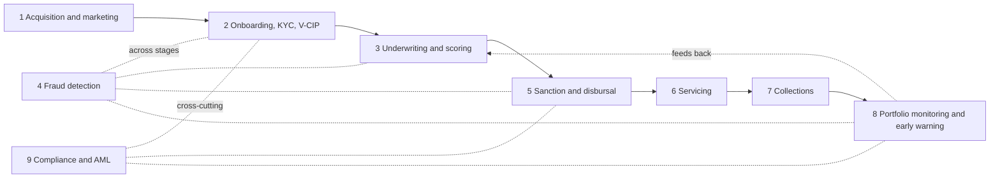

# CIS foundation: AI across the Indian retail and MSME lending workflow

Working foundation document for the MBA Course of Independent Study. Built from five research notes dated 6 Oct 2026 (the earlier industry-choice report, the banking_lending notes, and three verification notes on Bajaj, the banks, and RBI/regulators). Where a verification note contradicts an earlier note or the earlier report, the verification note is used. Some source documents are dated 2026; dates are kept as given in the notes.

## How to read the grades

| Grade | Meaning |
|---|---|
| A | Verified at the primary document, read directly by the verifying agent |
| B | Primary document exists but was seen only through a secondary summary |
| C | Press, vendor or consulting source only |
| X | Unverified, not found, or contradicted. Do not cite |

Reading limits that apply throughout:
- "Read directly" means the verification agent extracted text from the document. It does not mean the student has read it. Every A-grade number should be re-checked by hand in the original before it goes into the final paper (see Section 7).
- Page numbers are the ones recorded in the notes. They are either printed page, PDF page or slide number, as labelled. Bajaj transcript page numbers are approximate to one page (taken from "Page x of N" footers).
- Almost all A-grade AI figures are company self-reports. They are verified as "the company said this", not as independently audited outcomes.

## Disagreements between notes (resolved in favour of verification notes)

| Topic | Earlier note or report | Verification result |
|---|---|---|
| Explainability and audit | "15% used interpretation tools or audit logs" | 15% used interpretation tools such as SHAP or LIME, and 18% kept audit logs (two separate figures) |
| 38% prefer rule-based models | Reported as a survey figure | RESOLVED in round 2: not in the body text, but Figure 4 (printed p.27, PDF p.36) is a pie chart showing simple rule-based models 38%, moderately complex ML 31%, simple and advanced combination 25%, advanced ML 6% (sums to 100%). The report states no denominator beside the chart. Cite as "Figure 4, FREE-AI report", and do not call it "38% of entities" without checking the denominator |
| 35% bias validation | Presented as a bias-testing rate | True, but the report says it was limited to the development stage and did not extend to deployment |
| FSR "herding" | Earlier report says the FSR flagged herding | The word does not appear in the June 2026 or December 2025 FSR |
| Bajaj "sales dropped from scope" | Earlier report says sales was dropped | Contradicted. The Q4 call did not name Sales, but the Q1 FY27 deck lists Sales in the 600+ agents scope |
| Bajaj 800+ to 600+ "cut" | Earlier report says the target was cut | Only partly supported. The Q4 deck contains both 800+ (roadmap slide 12) and 600+ (metrics slide 11). The "cut" is MediaNama's reading |
| Bajaj 30 bp opex-to-NII | Earlier notes tie it to bots | Not found. Bajaj reports opex to NTI, FY26 improvement 36 bps. Not attributed to AI by Bajaj |
| MuleHunter bank count | 23 banks (press, RTI, 10 Dec 2025) | RBI Annual Report 2025-26: 26 banks implemented as of 31 Mar 2026, four more underway. Press "31 banks" not tied to any RBI document |
| SBI AI-lead figure | Rs 22,000 crore of AI leads | Not found as stated. Likely corresponds to retail analytical-lead advances of Rs 22,396 crore in Q1 FY27 only (verifier's inference) |
| SBI early warning and digital disbursal | 90-day flags; over 60% of PLs in under 4 hours | Both NOT-FOUND in any SBI document read |
| Fraud totals FY25 | Rs 36,014 crore | Later revised to Rs 32,803 crore (23,722 cases) in the 2025-26 Annual Report |
| Axis chatbot staff figure | 87,000 employees | "Reached 87,000+" in MD letter (PDF p.68), but "supports over 84,000" and ~35,000 monthly users elsewhere in the same report |
| Bajaj bot count | "27 bots live" (Q1 call) | Q1 FY27 deck shows 10 voice + 24 text = 34. The call repeats the Q4 figure |
| Bajaj agentic applications | 17 of 118 deployed (Q1 call) | Q1 deck says 23 deployed, target 118 |
| Upstart US figures | 41.4% more approvals, 33.1% lower APR | A search snippet gave 44% and 16%. Differences by period and definition. Not resolved |
| DPDP main-duty date | Report: May 2027 | RESOLVED in round 2 from Rule 1 of the gazette text: notified 13 Nov 2025, Consent Manager rule 13 Nov 2026, main rules 13 May 2027 (18 months). A Jan 2026 consultation proposed 12 months; no amendment found |
| Axis unsecured BL digital share | 77% | A June 2026 media roundtable said "nearly 75%". 77% is in the Q1FY27 deck (18 Jul 2026) |
| SBI data scientist headcount | 67 (AR FY26 PDF p.492) | 45+ (PDF p.486, same report), and 45+ in FY25 AR. Internally inconsistent. Both statements confirmed in the extracted AR text (the 67 reads "67 laterally recruited data scientists"). Cannot be reconciled from the document, so cite "140+ live models" and avoid the headcount |
| SBI PABL FY26 | Rs 5,513 crore (AR) | Rs 6,765 crore (Q4FY26 presentation slide 42). Not reconciled |

---

## 1. Workflow map

**Status of this section: the nine stages and the sub-step breakdown below are a working framework, not a sourced taxonomy.** The nine-stage list comes from the earlier research note. The 3-6 sub-steps per stage and the one-line descriptions are the author's working structure for organising evidence. They describe a typical Indian retail and MSME lending process in general terms and are not taken from a regulator or industry source. Individual lenders will differ, and the NBFC, bank and fintech-partner (LSP) models differ in who performs each step.

### 1.1 Flow diagram

```
 [1 Acquisition   ]   [2 Onboarding   ]   [3 Underwriting ]   [5 Sanction &  ]
 [  & marketing   ]-->[  KYC / V-CIP  ]-->[  & scoring     ]-->[  disbursal   ]
        |                    |                   |                    |
        |                    +---> [4 Fraud detection] <-------------+
        |                          (runs across stages 2, 3, 5, 6, 7)
        v                                                           v
 (leads, offers,                                              [6 Servicing    ]
  pre-approvals)                                              [  & support    ]
                                                                    |
                                                                    v
                         [8 Portfolio monitoring ]<--------- [7 Collections   ]
                         [  & early warning      ]---------> [  & recovery    ]
                                    |
                                    v
        [9 Compliance & AML]  (cross-cutting: KYC rules, reporting, model governance, data protection)
```



### 1.2 Stage breakdown

| # | Stage | Sub-steps (working framework) | How it works today in Indian retail and MSME lending (one line) |
|---|---|---|---|
| 1 | Acquisition and marketing | 1a Lead generation (own customer base, partners, digital channels); 1b Lead scoring and pre-approved offer generation; 1c Outbound and inbound sales contact (calls, SMS, app, WhatsApp); 1d Campaign content and personalisation | Lenders mine existing-customer data and channel traffic to push pre-approved offers and route interested leads to digital journeys or sales staff. |
| 2 | Onboarding and KYC/V-CIP | 2a Application capture and document upload; 2b Document reading and data extraction; 2c Identity verification (Aadhaar-based, CKYC, bureau and other checks); 2d Video-based customer identification (V-CIP) with liveness and face match; 2e Customer record creation | Applicants submit documents digitally, data is extracted and verified, and where face-to-face is not used, a recorded V-CIP session meets RBI KYC standards. |
| 3 | Underwriting and scoring | 3a Data collection (bureau, bank statements, GST, Account Aggregator data); 3b Scorecard or model run; 3c Policy and rule engine decision; 3d Manual review for exceptions (credit memo, personal discussion notes for MSME); 3e Pricing and limit assignment | Automated scorecards and rule engines decide small tickets, while larger MSME cases still go through analyst review of financials and discussion notes. |
| 4 | Fraud detection | 4a Application and identity fraud checks; 4b Document tampering and duplicate checks; 4c Mule and transaction anomaly detection; 4d Branch and staff conduct risk; 4e Fraud case investigation and reporting | Checks run before disbursal and on live accounts, with reporting duties to RBI for classified frauds, and fraud losses in India sit mostly in the loan book. |
| 5 | Sanction and disbursal | 5a Sanction letter and terms (KFS, APR) generation; 5b Customer acceptance and e-sign; 5c Final pre-disbursal checks; 5d Disbursal to borrower or supplier account; 5e Booking in the loan management system | After approval, terms are disclosed and accepted digitally and funds move directly from the lender to the borrower, with no pass-through by a service provider under the Digital Lending Directions. |
| 6 | Servicing and customer support | 6a Self-service via app, chat, voice bots; 6b Agent handling of queries and requests; 6c Service requests (statements, restructuring, foreclosure); 6d Complaint handling; 6e Cross-sell and top-up offers | A mix of self-service bots and contact-centre agents handles routine queries, with escalation to human staff for complex cases and complaints. |
| 7 | Collections and recovery | 7a Pre-due reminders (SMS, calls, bots); 7b Early-bucket contact and promise-to-pay tracking; 7c Prioritisation and allocation (in-house versus agency); 7d Late-bucket and field collection; 7e Legal and asset recovery | Reminders and soft-bucket calls start before or at due date, allocation goes to in-house teams or outsourced agencies, and late-stage cases move to field and legal recovery. |
| 8 | Portfolio monitoring and early warning | 8a Account and portfolio data aggregation; 8b Early warning signal generation (transactional, financial, external data); 8c Stress-bucket tracking (SMA categories); 8d Review and action by credit or risk team; 8e Red-flagging and reporting where fraud is suspected | Banks watch account behaviour and external signals to spot stress before default, and RBI's fraud framework requires an EWS and red-flagging process with set reporting timelines. |
| 9 | Compliance and AML | 9a KYC refresh and ongoing due diligence; 9b Transaction monitoring and suspicious activity reporting; 9c Regulatory reporting (including lending-app and fraud reporting); 9d Model governance, audit and explainability; 9e Data protection and consent management | Regulatory obligations cut across all stages, and AI use here is mostly about monitoring, model governance and consent rather than customer-facing automation. |

---

## 2. Evidence table by stage

Only grade A and B items are in this table. Grade C and X items are in Section 2.2. "Who" is the institution that made the disclosure. All AI figures are company self-reports unless stated. "Page" is as recorded in the notes (slide number, PDF page or printed page, as labelled).

### 2.1 Main table (grade A and B only)

| Stage | What AI is used for | Who | Quantified fact | Source document, date, page | Grade |
|---|---|---|---|---|---|
| 1 Acquisition | Voice and text bots generate leads that convert to loans | Bajaj Finance | Disbursal from leads generated by voice and text AI bots: Rs 2,551 crore in Q1 FY27 (call rounds to Rs 2,500 crore), +235% YoY, against Rs 761 crore in Q1 FY26 and Rs 1,895 crore in Q4 FY26. FY26 total Rs 5,520 crore. This is disbursal from bot-generated leads, not loans fully originated and approved by a bot | Q1 FY27 Investor Presentation, ~30 Jul 2026, slide 11 row 8; Q1 FY27 earnings call, 30 Jul 2026, p.5; Q4 FY26 deck, 29 Apr 2026, printed slide 10 [PDF p.11] | A |
| 1 Acquisition | Voice bot contribution to personal-loan originations | Bajaj Finance | "17%-18% is coming from voice bot", about 20% with data bots. Oral estimate by the MD for consumer personal loans only, for "a given month" (Rs 4,000-6,000 crore base stated loosely). Not a reported KPI and not in the deck | Q1 FY27 earnings call, 30 Jul 2026, p.9 | A (quote read directly; qualified) |
| 1 Acquisition | Voice-log analysis generates offers | Bajaj Finance | Rs 517 crore disbursals from voice log processing in Q1 FY27 (Rs 372 crore in Q4 FY26), with 4 lakh additional offers | Q1 FY27 call, p.5; Q1 deck, slide 11 | A |
| 1 Acquisition | Analytics-generated leads | SBI | Advances through analytical leads Rs 1,80,518 crore in FY26; Rs 44,759 crore in Q1 FY27 (+34.1% YoY); Q1 FY27 retail Rs 22,396 crore. The documents say "analytical leads", not "AI". FY25 was Rs 1.24 lakh crore | SBI Analyst Presentation Q1FY27, 7 Aug 2026, PDF p.34; Q4FY26 presentation PDF p.42; SBI Annual Report FY26 PDF p.109 (printed p.107, labelled "income earned", a mislabel); AR FY25 PDF p.89 | A |
| 1 Acquisition | Sector-wide adoption split | RBI survey of 612 supervised entities | Sales and marketing was 11.8% of 583 AI applications in production and development | RBI FREE-AI Committee report, 13 Aug 2025, §3.3.5, p.27 | A |
| 2 Onboarding and KYC | AI-assisted document reading and onboarding | Axis Bank | ~34 Mn AI-assisted document reading and ~1.05 Mn AI-assisted onboarding in Q1FY27; 115 Mn+ AI-led document services in FY26 (AXIOM "Zero Ops") | Axis Q1FY27 investor presentation, 18 Jul 2026, PDF p.15; Axis Integrated Annual Report 2025-26, PDF pp.110-111 | A |
| 2 Onboarding and KYC | Document processing for loan applications | Bajaj Finance | Documents processed for applications: 32 MM in Q1 FY27 (+196% YoY); 25 MM in Q4 FY26; 69.1 MM in FY26 | Q1 deck slide 11; Q4 deck slide 10 | A |
| 2 Onboarding and KYC | Face recognition cameras for customer identification | Bajaj Finance | 60 in store at Q4 FY26; 92 in store and 452 in service branches at Q1 FY27. Q4 call says close to 2,700 cameras planned at about 3,000 stores/branches | Q1 deck slide 10; Q4 FY26 call, 29 Apr 2026 | A |
| 2 Onboarding and KYC | V-CIP rules (no statistic) | RBI | Liveness and spoof detection is mandatory. AI is optional ("may use appropriate AI"). The word "deepfake" does not appear | RBI (Commercial Banks - KYC) Directions 2025, 28 Nov 2025 (copy updated 1 Oct 2026), Para 27(1)(iii), (v), (vi), (vii), PDF pp.31-32 | A |
| 3 Underwriting | Sector-wide adoption split | RBI survey | Credit underwriting was 13.7% of 583 applications. Footnote 38 defines it broadly: ML credit scoring (personal loans, credit cards) plus OCR/RPA document extraction for loan processing. Only 20.80% (127) of 612 entities used or were developing AI | RBI FREE-AI report, 13 Aug 2025, §3.3.2 p.25, §3.3.5 p.27, fn 38 | A |
| 3 Underwriting | Business Rule Engine, single credit-risk model for SME loans up to Rs 5 crore, straight-through processing | SBI | FY26: 2.43 lakh proposals worth Rs 99,505 crore sanctioned. Since Jan 2024: 3.99 lakh proposals worth Rs 1,52,942 crore. The AR calls it a rule engine and credit risk model and does not use the word "AI". "AI underwrote" is the MD's framing | SBI Annual Report 2025-26, PDF p.63 (printed p.61) | A |
| 3 Underwriting | ML models across credit risk, fraud, segmentation and others | SBI | "Over 140 AI and ML models live in production" including credit risk scoring (PDF p.492); the same report says 45+ data scientists and 140+ models on PDF p.486 (inconsistent with 67 data scientists) | SBI AR FY26, Sustainability Report, PDF p.492 (printed p.128) and p.486 | A |
| 3 Underwriting | Pre-approved loan limits surfaced across channels | HDFC Bank | "Reducing eligibility search effort by approximately 50 per cent" for home loan pre-approvals. It is search effort, with no baseline or measurement method stated | HDFC Integrated Annual Report 2025-26, PDF p.49 (printed p.51) | A |
| 3 Underwriting | AI summarisation of underwriter notes | Bajaj Finance | "20% plus efficiency using AI" in underwriting (Q1 FY27); FY27 assessment 30%. Definition of the metric (asterisk in deck) not extracted. 2.3 million underwriter discussion notes converted to structured data (no outcome number) | Q1 FY27 call, p.5; Q1 deck slide 11 row 7; Q4 deck; Bajaj AR FY26, PDF p.56 | A |
| 3 Underwriting | Custom AI model to expand data variables for new-to-bank and new-to-credit customers | Bajaj Finance | Target of about 5 lakh incremental accounts (Sales Finance) and "0.5 million customers that we could not do earlier"; going live Q2 FY27. These are targets, not results | Q4 deck slide 13 item 4.1; Q1 deck slide 13 items 4.1, 4.2; Q1 call p.5 | A (target) |
| 3 Underwriting | ML models in credit | Axis Bank | "100+ ML models across credit risk, financial crime, marketing and collections"; "55+ credit models" | Axis IAR 2025-26, PDF p.111; Q1FY27 deck, same slide as the "18 Mn+ Collections: Bot-based calling" line (PDF p.15 per the notes; confirmed in the extracted text that the 55+ credit models line sits in the same block) | A |
| 3 Underwriting | Data rail for underwriting (not AI itself) | Sahamati (Account Aggregator) | FY26 estimated Rs 3.82 lakh crore across 3.68 crore loans; 8.4% of India's retail and MSME lending by value, 11.8% by volume; new-to-credit 18.2% of AA originations by volume among participating institutions; home loans and LAP 1.09 lakh loans, Rs 20,777 crore. Industry body self-reporting, estimate, not audited RBI data | Sahamati press release, 27 Aug 2026, citing "Credit Reimagined: AA Impact Report H2 FY26" (press release read; abridged report PDF is image-only and unread) | A (press release) |
| 3 Underwriting | Automated lending comparator (US) | Upstart | 91% of loans fully automated in 2025; 41.4% more approvals at 33.1% lower APR at equal loss (company-defined). A snippet gave 44% and 16%. US company, self-serving, not read in the verification round | Upstart 2025 Annual Report (earlier notes only) | B |
| 4 Fraud | Problem size (regulator data) | RBI (supervisory returns) | AR 2024-25: 23,953 cases, Rs 36,014 crore, advances 7,950 cases and Rs 33,148 crore (92.1% of value); card/internet 13,516 cases and Rs 520 crore. Includes 122 cases worth Rs 18,674 crore reclassified from earlier years. Data cover frauds of Rs 1 lakh and above; amounts are not losses | RBI Annual Report 2024-25, 29 May 2025, Ch. VI, Table VI.2 printed p.137 (PDF p.19), Table VI.3 printed p.138 (PDF p.20) | A |
| 4 Fraud | Problem size, latest | RBI | AR 2025-26: 10,114 cases, Rs 48,021 crore; advances 8,640 cases and Rs 40,774 crore (84.9% of value); card/internet/digital payments 293 cases and Rs 29 crore. FY25 restated to 23,722 cases and Rs 32,803 crore. Includes 314 cases worth Rs 30,199 crore reclassified from earlier years (about 63% of the FY26 amount) | RBI Annual Report 2025-26, 29 May 2026, Tables VI.2 (printed p.105) and VI.3 (printed p.106), PDF pp.131-132 | A |
| 4 Fraud | MuleHunter.AI (RBIH supervised ML model for mule accounts) | RBI / RBIH | Implemented in 26 banks as of 31 Mar 2026, four more underway. Output is a confidence score, and banks decide the action. No numeric accuracy in any RBI or RBIH document | RBI Annual Report 2025-26, §VI.57, printed p.~98 (PDF p.124); RBI AR 2024-25 §VI.54 printed p.135 (PDF p.17); RBIH docs (docs.rbihub.in/mule-hunter) | A |
| 4 Fraud | Fraud value prevention | Axis Bank | "~320% YoY improvement in fraud value prevention" (Q1FY27). No base value given in the notes | Axis Q1FY27 deck, 18 Jul 2026, same slide as the "18 Mn+ Collections: Bot-based calling" line (PDF p.15 per the notes; confirmed in the extracted text, same block as the "55+ Credit models" line) | A |
| 4 Fraud | AI/ML engine to flag high-risk branches | SBI | Suo moto investigations in 1,736 branches | SBI AR FY26, PDF p.465 | A |
| 4 Fraud | Planned inline AI fraud model (Vision AI, Voice AI, network and anomaly detection) | Bajaj Finance | Plan only. Framework defined in Q4 FY26. Deployment timeline Q3 FY27 "on track". No fraud-loss figure | Q4 deck slide 13 [PDF p.14] item 5; Q1 deck slide 14 items 5.1, 5.2 | A (plan) |
| 5 Sanction and disbursal | Digital lending journeys (digital, not necessarily AI) | Axis Bank | "End to End digital lending contributes ~77% to overall unsecured BL disbursements" | Axis Q1FY27 investor presentation, 18 Jul 2026, PDF p.24 (slide 23) | A (not an AI metric) |
| 5 Sanction and disbursal | Pre-approved and real-time personal loans | SBI | FY26 via YONO: 2.00+ lakh pre-approved personal loans, 0.55+ lakh real-time personal loans; digital PAPL Rs 15,564 crore. "4" in public material is "4 clicks" (Pre-Approved Pension Loan), not "4 hours" | SBI AR FY26, PDF p.100 and p.54; Q4FY26 presentation PDF p.42 | A |
| 6 Servicing | Bots handling self-service interactions | Bajaj Finance | 71% of DIY customer-service volumes handled by AI voice and text bots in Q1 FY27 (72% in Q4 FY26, 50% in Q1 FY26, 69% in Q3 FY26). It is a share of DIY (self-service) interactions only, not all service volume | Q1 call, 30 Jul 2026, p.5; Q1 deck slide 11 row 9; Q4 deck, 29 Apr 2026, printed slide 10 [PDF p.11] | A |
| 6 Servicing | Voice AI cost | Bajaj Finance | "voice AI will be like 1/3 of the human cost today"; MD: use case must be at "1/3, 1/5 the cost". Also "AI call center agent is one-third of the cost". Management statement, no cost base disclosed | Q1 call p.11; Q4 call p.12 | A |
| 6 Servicing | Co-pilot email resolution | Bajaj Finance | 32% email resolution by co-pilot service agents (FY26) | Bajaj AR FY26, FINAI Transformation page, printed pp.14-15 | A |
| 6 Servicing | In-house AI platform use cases | HDFC Bank | "5 use cases in production and 14 more in development" | HDFC Q4 FY26 earnings call, 18 Apr 2026 (filed 24 Apr 2026), PDF p.5 | A |
| 6 Servicing | Inbound communication and workflow bots | ICICI Bank | "More than 100 autonomous bots" for inbound customer communications and "more than 150" for repetitive workflows. Operational counts only | ICICI Annual Report 2025-26 HTML, "Our Business Strategy" chapter (publication date not stated) | A |
| 6 Servicing | Internal GenAI assistant | Axis Bank | "Reached 87,000+ employees" (MD letter, PDF p.68) versus "supports over 84,000 employees", ~35,000 monthly users, 81% of branch-level queries resolved (PDF p.110). Use the lower, usage-based wording | Axis IAR 2025-26, PDF pp.68, 110-111 | A (conflict inside the report) |
| 6 Servicing | Sector-wide adoption split | RBI survey | Customer support was 15.6% of 583 applications | RBI FREE-AI report, §3.3.5, p.27 | A |
| 7 Collections | AI text and voice bots in debt management | Bajaj Finance | Receipts through AI text bots: 6,632 in Q4 FY26 (0 in Q3), 0.10 MM in Q1 FY27; voice bot receipts 0.1 MM in Q4 FY26, 0.3 MM for FY26 (Q4 deck only); SMS with AI text bot penetration 14% and click-through 1.0X in Q1 FY27. Activity counts only. No recovery rate, roll-back or delinquency figure | Q4 deck, printed slide 11 [PDF p.12] row 10; Q1 deck slide 12 [PDF p.12] | A |
| 7 Collections | AI outbound voice agents (not collections-specific) | Bajaj Finance | Had 5,000 outbound voice agents, reduced, and 30% of them are now AI voice agents, "one-third of the cost". Refers to outbound voice generally | Q4 FY26 call, p.12 | A (qualified) |
| 7 Collections | Bot-based collection calling and in-housing | Axis Bank | "18 Mn+ Collections: Bot-based calling" (YTD Q1FY27). Management says AI bots and score-based in-housing can reduce agency and call-centre allocations. No contact rate, roll-back or cost figure. Management expects "meaningful bottomline impact over the next 18-24 months" | Axis Q1FY27 deck PDF p.15 (AXIOM slide); Axis IAR 2025-26, PDF p.67 | A |
| 8 Portfolio monitoring and EWS | Rules for EWS and red-flagging (technology-neutral, no AI mention) | RBI | Board-approved EWS and Red Flagging of Accounts framework (3.1.1); examination of EWS alerts preferably within 30 days (3.1.3); CRILC-threshold red-flagged accounts reported to RBI within seven days (3.3.4); dedicated Data Analytics and Market Intelligence Unit (3.3.2); EWS effectiveness to be tested periodically (3.4.1) | Master Directions on Fraud Risk Management in Commercial Banks and AIFIs, 15 Jul 2024, Ch. III (paragraph numbers as cited). Round 2 found a newer "Commercial Banks - Fraud Risk Management Directions", 31 Jul 2026 (RBI/DoS/2026-27/412), that appears to replace it; its EWS/RFA rules are in Ch. III paras 12-25 (see Section 5). Cite the 2026 text for current rules and the 2024 text only as history | A |
| 8 Portfolio monitoring and EWS | AI portfolio monitoring summaries for corporate book | ICICI Bank | Summaries "for thousands of companies"; "millions of pages indexed"; "nearly 100% trace-to-source integrity". Qualitative counts, no hit rate | ICICI AR 2025-26 HTML, "Our Business Strategy" | A (qualitative) |
| 8 Portfolio monitoring and EWS | Qualitative EWS statements | SBI, HDFC, Axis, Bajaj | No hit rate or lead time disclosed by any. Examples: SBI AR FY25 PDF p.21 ("leveraging advanced analytics for ... early warning detection"); HDFC IAR 2025-26 PDF p.95 ("Early warning systems powered by analytics have already been introduced"); Axis IAR PDF p.95 and Q1FY27 deck p.24 ("EWS portfolio monitoring indicates risks under control"); Bajaj AR FY26 PDF p.83 (does not say AI) | As listed | A (qualitative only) |
| 9 Compliance and AML | Model governance practice among 127 AI-using entities | RBI survey | 15% used interpretation tools (SHAP, LIME); 18% kept audit logs; 35% validated for bias and fairness, but only at development stage, not deployment; 28% human-in-the-loop; 10% bias-mitigation protocols; 14% regular audits; 37% periodic retraining; 21% drift monitoring; 14% real-time performance monitoring | RBI FREE-AI report, §3.3.13, pp.31-32 | A |
| 9 Compliance and AML | Ongoing due diligence | RBI | Banks "may consider adopting appropriate innovations including AI and ML". Optional | RBI Commercial Banks KYC Directions 2025, Para 40, PDF p.40 | A |
| 9 Compliance and AML | Transaction monitoring study | RBI | Thematic supervisory studies in 2025-26 covered AI adoption and "efficacy of the transaction monitoring systems in major banks". No findings published | RBI Annual Report 2025-26, §VI.77 | A (existence only) |

Cross-bank check from the bank verification note: none of SBI, HDFC, Axis, ICICI or Kotak disclosed an AI collections contact rate, roll-back rate or cost-to-collect figure, nor an early-warning hit rate or lead time, in the documents read. Axis is the only one with a collections AI volume metric. Kotak disclosures found were qualitative (for example ML fraud monitoring "often within minutes", PDF p.31; a 33% reduction in complaint resolution turnaround, PDF pp.17, 43, not specifically AI).

### 2.2 Do not cite / needs checking

| Item | Where it appeared | Grade | Reason and correction |
|---|---|---|---|
| SBI: over 60% of personal loans under Rs 10 lakh disbursed via pre-approved digital channel in under 4 hours | Earlier notes and report (search summary) | X | NOT-FOUND in SBI AR FY25, AR FY26, Q4FY26 and Q1FY27 presentations, Q1FY27 press release, or three press versions of the FIBAC story. The "4" in public material is "4 clicks". May be a garbling |
| SBI: MSME early-warning flags up to 90 days ahead | Earlier notes and report | X | NOT-FOUND. No lead time in any SBI document. Press says only "AI-based early warning signals ... before delinquencies emerge" (Outlook Business, 12 Aug 2026). SMA-2 is 61-90 days and 90 days is the NPA threshold in the AR, which may be the source of the confusion |
| SBI: "AI underwrote nearly Rs 1 trillion of MSME loans" | Business Standard headline (12 Aug 2026, page returned 403); Hans India 13 Aug 2026 | C as stated | Source is a speech by the MD, not a document. Use the AR figure (Rs 99,505 crore sanctioned via BRE in FY26, grade A) and note the AR calls it a rule engine and does not say AI |
| SBI: Rs 22,000 crore of AI-generated leads | Financial Express B2B, 18 Aug 2026 | C | Attributed to the Chairman in press. Not found as stated. Likely the retail piece of Q1 FY27 analytical-lead advances (Rs 22,396 crore), which is a verifier inference. Not a full-year or all-AI total |
| SBI: cheque processing about 25% of volumes via AI/LLM | Hans India, 13 Aug 2026 (MD speech) | C | Presentation confirms GenAI cheque processing up to Rs 10,000 but gives no volume share |
| Bajaj: "sales dropped from scope" | Earlier report, MediaNama May 2026 | X (contradicted) | Q4 call wording omitted Sales in a verbal list, but the Q1 FY27 deck slide 13 item 3.1 lists Sales within 600+ agents. No Bajaj document says Sales was removed |
| Bajaj: autonomous-agent target "cut from 800+ to 600+" | Earlier report, MediaNama | C (partial) | The Q4 deck contains both: 800+ on roadmap slide 12, 600+ on metrics slide 11 and in the call. Bajaj never says "cut" or gives a reason. The Q3 deck was not fetched. Treat as an inference |
| Bajaj: 30 bp opex-to-NII improvement linked to AI | Earlier notes (search summary) | X | NOT-FOUND. Bajaj reports opex to net total income (NTI). FY26 improvement was 36 bps (Q4 deck slide 27; Q4 call p.6). AR FY26 Table 7 ("Total operating expenses to NTI") shows 33.34% vs 33.86% (about 52 bps). Checked in the extracted MD&A text: the table's row labels are misaligned by text extraction (the 33.34%/33.86% values sit under an "Adjusted ROA" label but belong to the opex-to-NTI row, since ROA is 4.56%). The two figures are probably on different bases (Q1 FY27 deck footnote: opex to NTI is "post presentation change (NPL recovery net off from loan losses)"), so they cannot be reconciled from these documents. Quote the 36 bps with its source (Q4 call) or avoid the number. Bajaj cites gold loan and MFI branch investment, not AI. Q1 FY27 opex to NTI 33.4%, "marginally higher". FY27 guidance 25-40 bps, with the comment "we'll probably need AI to be able to deliver that" |
| Bajaj: Rs 5,520 crore "personal loans via conversational bots" | Earlier notes | A for the number, label caution | Number verified. Decks label it "disbursal from leads generated by Voice and Text AI BOTs". AR labels it "Personal Loan disbursement via conversational bots". Probably the same series, but no Bajaj statement confirms. Prefer the deck label |
| Bajaj: "10 bots replaced about 1,500 agents, cost down about 70%" | Trak.in | C | Low-grade secondary. Conflicts with management's one-third cost figure. Do not use without call transcript |
| Bajaj: "442 AI voice bots" and "Rs 1,980 crore PL" | Web search summaries | X | Could not be confirmed in any Bajaj document |
| Bajaj: Diwali peak day 600,000 loans vs 100,000 without AI | MediaNama, May 2026 | C | Not checked in the verification note. Locate in the Q4 call or deck before use |
| Bajaj: Collections 2.0 "AI-driven delinquency management" | Bajaj AR FY26 (printed p.~58, PDF p.72) | A (but not Bajaj's) | Refers to Pennant Technologies, a 26.53%-owned vendor and LMS provider. Not a Bajaj Finance deployment |
| Bajaj: voice bots 17-18% of "loan originations" | MediaNama, Aug 2026 | Qualified | Oral estimate for consumer personal loans only. Directionally right but over-generalised in press. In main table with qualifier |
| Bajaj: "almost 100% of videos AI-generated" | Q4 call p.5 | A with oddity | Q1 deck shows 0.01 MM videos in Q1 FY27 vs 0.53 MM in Q1 FY26, likely unit or definition change. Avoid |
| RBI survey: "38% preferred simple rule-based models" | Earlier notes and report (MediaNama, Khaitan) | A with qualifier (upgraded from X in round 2) | The 38% exists in Figure 4 (printed p.27, PDF p.36), a pie chart of model complexity: rule-based 38%, moderately complex ML 31%, combination 25%, advanced ML 6%. The press wording "preferred ... for explainability" is not what the chart shows, and no denominator is printed beside it. Cite the chart as it is |
| KYC: "deepfake detection requirement" and "added Aug 2025" | HyperVerge blog (vendor) | X | NOT-FOUND. "Deepfake", "deep fake" and "synthetic" appear zero times in the KYC Directions. Liveness and spoof detection is mandatory; AI is permitted ("may"). Not shown to be new in Nov 2025, since the Directions were a consolidation and were not compared with the 2016 text |
| Digital Lending Directions: "algorithm/AI disclosure rule" | Implied in earlier framing | X (contradicted) | The words "algorithm" and "artificial intelligence" do not appear anywhere. Closest is Para 6(ii): a consistent approach for similarly placed borrowers, and the matching mechanism and changes must be documented (multi-lender RE-LSP arrangements, effective 1 Nov 2025) |
| MuleHunter: accuracy "85%+", "up to 90%", "3x manual" | Press | C | Not tied to any RBI or RBIH document. No numeric accuracy in RBI documents. Discard |
| MuleHunter: Canara Bank "95% accuracy" | MediaNama RTI article, Dec 2025; The420 | C | Unaudited bank claim, press only. Not found in RBI documents |
| MuleHunter: 23 banks (10 Dec 2025) and 31 banks | MediaNama RTI; RMA India item | C | RBI figure is 26 banks as of 31 Mar 2026 (grade A). Press counts are different dates or unsourced. RBI declined to give the number of mule accounts identified. A "64 lenders (41 banks and 23 NBFCs)" figure belongs to the Unified Lending Interface section of a PIB backgrounder, not to MuleHunter |
| RBI FSR "flagged herding from similar models" and "third-party concentration" | Earlier report (MediaNama) | X (herding); partial | "Herding" appears in neither the June 2026 nor December 2025 FSR. AI-linked market concentration (valuations) and AI-enabled cyber threats (June 2026 PDF p.71) are present. Third-party risk appears only as an FSB point and survey option. "Not every page read line by line" |
| Fraud "tripled" in FY25 | Business Standard headline | Misleading | Rs 36,014 crore includes Rs 18,674 crore reclassified from earlier years (122 cases). FY25 later restated to Rs 32,803 crore. FY26 Rs 48,021 crore is about 63% older frauds reclassified (Rs 30,199 crore). Do not present as new fraud |
| HDFC: about $1 billion technology investment over five to six years | Financial Express B2B, 18 Aug 2026 | C | Not found in transcript text searched. Unverified |
| ICICI: technology about 11% of opex (11.4% in Q1FY27) | Financial Express B2B | C | Not verified in a primary document |
| ICICI: pre-delinquency engine using over 100 variables | One web search summary | X | NOT-FOUND in FY25 and FY26 annual-report chapters. FY23 and FY24 chapters did not load. Do not cite until the original is located |
| Axis: "more than 50% AI coverage of calls by FY27" | Business Standard 25 Jun 2026 via search summary | C | Not read directly |
| Axis: "nearly 75% unsecured loans digital" | FintechBizNews, 24 Jun 2026 | C | Different data point from the 77% in the Q1FY27 deck. Use the deck |
| "AI scoring improves default prediction 15-25%, reduces defaults up to 30% in India" | Search summary | X | No traceable source |
| "65% of FIs deployed AI in credit scoring by 2025 (Accenture)" | stealthagents.com | X | Aggregator only |
| Paytm: AI credit approval and disbursal in two minutes | Paytm product page | C | Marketing |
| McKinsey: credit-analyst productivity +20-60%, collections opex cut up to 40%, recoveries about +10%, collections productivity up to 30%; EY: GenAI productivity up to 46% in Indian banking ops by 2030 | McKinsey, EY pages | C | Consulting estimates and "up to" figures, not realised results. Use only as labelled estimates |
| RBI survey percentages via Khaitan, MediaNama, KPMG summaries | Earlier notes | Superseded | Primary text now read (grade A). Cite RBI FREE-AI report, not summaries |
| Upstart US figures | Upstart annual report; Investing.com | B | Conflicting snippet (44% / 16%). If used, label as US company-defined |
| Axis: 87,000 employees "using" the chatbot | Earlier report | Qualified | "Reached 87,000+" is cumulative reach. See main table. "Amber ... 87,000 chats" is a different Axis figure and must not be confused |

---

## 3. Stage coverage heatmap (verified evidence depth)

Depth rating describes how much grade A or B evidence exists on AI use and outcomes at Indian lenders, not how important the stage is. "Strong" means multiple A-grade quantified disclosures over time. "Some" means A-grade activity counts or partial metrics, but no outcome. "None" means no verified quantified AI evidence.

| # | Stage | Verified depth | What exists | What it implies |
|---|---|---|---|---|
| 1 | Acquisition and marketing | Some | Bajaj lead-to-disbursal series (three quarters), SBI analytical-lead advances, RBI 11.8% adoption share | Volumes are verified, but "AI-generated lead" is company-defined and conversion, cost per lead and incrementality are not disclosed. Enough for description, not for impact claims |
| 2 | Onboarding and KYC/V-CIP | Some | Axis and Bajaj activity counts; RBI V-CIP rule text verified | Rules are clear and activity is counted, but no drop-off, fraud-catch or turnaround data. Good regulatory content, weak outcome content |
| 3 | Underwriting and scoring | Some | HDFC 50% search effort, Bajaj 20%+ efficiency, SBI BRE Rs 99,505 crore, model counts, AA data rail, RBI 13.7% | Efficiency and volume figures exist, but no verified approval lift or loss reduction at any Indian bank. SBI BRE is a rule engine, not shown to be machine learning |
| 4 | Fraud detection | Some (problem strong, AI outcome none) | RBI fraud tables (A, with reclassification caveats), MuleHunter 26 banks, Axis 320%, SBI branch engine, Bajaj plan | Problem size is well documented and mostly in loans, but AI outcome data on loan-side fraud is absent. MuleHunter is payment-side and has no published accuracy |
| 5 | Sanction and disbursal | Some | Axis 77% digital, SBI pre-approved loan counts | Digital share is verified, but it is not an AI metric. AI attribution is weak |
| 6 | Servicing and customer support | Strong | Bajaj 50%/69%/72%/71% self-service series, cost one-third, HDFC use cases, ICICI bot counts, Axis ADI, RBI 15.6% | Deepest verified evidence base with repeated management disclosures. Cost figures are statements without a cost base. Bajaj is tech-led and not representative of banks |
| 7 | Collections and recovery | Some | Bajaj bot receipts (counts), Axis 18 Mn+ bot calls, Axis in-housing narrative | Activity is verified, outcomes are not. No contact rate, roll-back, recovery or cost-to-collect at any of five banks. This is a disclosure gap, not proof of no impact |
| 8 | Portfolio monitoring and early warning | None on AI outcomes (rules strong) | RBI EWS and RFA rules verified; qualitative mentions at SBI, HDFC, Axis, ICICI, Bajaj | The SBI 90-day claim failed. No hit rate or lead time anywhere. RBI has no EWS effectiveness data. Regulation is well documented, so the stage supports a rules-versus-disclosure analysis but not an outcomes analysis |
| 9 | Compliance and AML | None on AI outcomes (governance survey strong) | RBI survey of governance practice, KYC Para 40 optional AI, transaction-monitoring study without findings | No Indian AML false-positive or SAR data. Governance survey is strong and primary, so a readiness-versus-expectations angle is possible |

---

## 4. Scope recommendation

Facts that drive the choice:
- No bank discloses collections contact rates, roll-back, cost-to-collect or early-warning hit rates or lead times (five banks checked).
- The SBI early-warning claims (90 days ahead, under 4 hours, 60%) were not found in any SBI document.
- Verified strongest disclosure sits in servicing (Bajaj), then underwriting-efficiency statements and activity counts in sales and collections.
- Loan-side fraud problem data is verified from RBI, and the EWS rules are verified, but AI outcome data is absent.

"Under-disclosed" is not the same as "under-adopted". A gap framed from absence of disclosure is a statement about transparency, and the project should say so.

### Candidate scopes

| Criterion | A: Collections plus early warning (as originally proposed) | B: Servicing, collections, underwriting; early warning treated as an under-disclosed gap | C: Fraud plus early warning, loan-side fraud, built on RBI data |
|---|---|---|---|
| Evidence strength | Weak. Collections has activity counts only (Bajaj, Axis). Early-warning half has no AI outcome data at any bank, and the SBI anchor failed | Moderate to good. Servicing is strong (Bajaj series, HDFC, ICICI, Axis). Underwriting has A-grade efficiency statements (Bajaj, HDFC, SBI BRE). Collections has activity counts. Early warning has rules and qualitative mentions only | Mixed. Problem data is strong and primary (RBI Tables VI.2 and VI.3, FRM Master Directions). AI outcome data is thin: MuleHunter 26 banks with no accuracy, Axis 320%, SBI branch engine, Bajaj plan. FY25 and FY26 fraud totals carry reclassification caveats |
| Gap clarity | Clear in principle, but both halves rest on missing data, so the gap cannot be sized | Clear and checkable: a bank-by-bank disclosure matrix showing which stage metrics exist and which do not. The gap is "adoption is visible, outcomes in collections and early warning are not" | Clear and anchored in A-grade data: over 84.9% to 92.1% of fraud value sits in advances while published AI fraud work centres on payments and mules. This remains an inference from two official datapoints |
| 80-hour feasibility | Feasible, but the second half would end with little to analyse | Feasible if depth is limited. Three stages plus a gap analysis is wide, so underwriting should be kept lighter | Feasible. Core documents are regulator PDFs already read. Risk: the FRM Directions were replaced by the 31 Jul 2026 version (EWS paragraphs now 12-25; repeal of the 2024 text not fully confirmed), and there is still no lender data on loan-fraud AI results |
| Recruiter appeal | High (lenders, collections analytics), but weakened if the proposal rests on unverified claims | High. Covers the stages banks and NBFCs hire for (customer experience, credit, collections) and uses Bajaj, HDFC, Axis, SBI, ICICI | Moderate to high for risk and fraud roles, narrower for general lending roles |

### Recommendation

Scope B is the recommended scope, with early warning kept as a named, evidence-graded gap and not as a pillar of the analysis. Reasons: it has the deepest verified evidence (servicing), it still includes collections and underwriting where A-grade figures exist, and it turns the failed early-warning claims and the missing collections outcomes into a finding that can be defended from documents. Keep underwriting as a lighter third stage, and state in the paper that the SBI BRE is a rule engine and that no verified approval lift or loss reduction exists at any Indian bank.

Scope C is the fallback if the student prefers to work from regulator data and wants a sharper problem statement. Scope A is not recommended as originally framed, because its two pillars are the two weakest-evidenced.

This is the student's decision. The ratings above are qualitative judgements from the notes and not scores from a sourced method.

---

## 5. Regulatory frame (verified items only)

| Item | What is verified | Source and location | Grade |
|---|---|---|---|
| FREE-AI status | A committee report, not an RBI Direction or Master Direction. Its own wording is "recommends" and "outlines 26 Recommendations". RBI Annual Report 2025-26 (29 May 2026), §VI.58 and Box VI.2 (printed p.~99, PDF p.125): "The Department is undertaking an assessment of the Committee's report and recommendations, which will help in formulation of more specific guidance". No later RBI AI instrument was located. A search of RBI circulars from June to October 2026 was not exhaustive | RBI FREE-AI report, 13 Aug 2025; RBI AR 2025-26 | A (recommendatory) |
| FREE-AI structure | 7 sutras (Trust is the Foundation; People First; Innovation over Restraint; Fairness and Equity; Accountability; Understandable by Design; Safety, Resilience and Sustainability). 26 recommendations under six pillars (Infrastructure, Policy, Capacity, Governance, Protection, Assurance). 13 on innovation enablement and 13 on risk mitigation (AR 2025-26, Box VI.2) | FREE-AI report, Executive Summary pp.iv-v; AR 2025-26 Box VI.2 | A |
| FREE-AI survey: 15% | Of 127 AI-using entities, 15% used interpretation tools (SHAP or LIME), and 18% maintained audit logs | FREE-AI report §3.3.13, pp.31-32 | A |
| FREE-AI survey: 35% (development stage only) | 35% validated for bias and fairness, but the practice was "limited to the development stages and did not extend to deployment" | Same | A |
| FREE-AI survey: adoption | 612 supervised entities surveyed Feb-May 2025 (banks, NBFCs, ARCs, AIFIs, close to 90% of asset size); 20.80% (127) using or developing AI; 583 applications | §3.3.1, §3.3.2, §3.3.5, pp.25-27 | A |
| Digital Lending Directions 2025: RE liability | RE must ensure LSPs and DLAs comply (Para 5(vi)); outsourcing to an LSP does not dilute or absolve the RE, which "shall remain fully responsible and liable for all acts and omissions of the LSP" (Para 5(vii)) | RBI (Digital Lending) Directions, 2025, RBI/2025-26/36, 8 May 2025 | A |
| Digital Lending Directions: no AI disclosure rule | "Algorithm" and "artificial intelligence" do not appear. Para 6(ii) requires a consistent approach for similarly placed borrowers and documentation of any matching mechanism and changes (multi-lender arrangements, effective 1 Nov 2025). Para 2(ii): effective immediately except Para 6 (1 Nov 2025) and Para 17 (15 Jun 2025) | Same | A |
| Digital Lending Directions: DLG | DLG only with an LSP or other RE engaged as LSP (Para 18(i)); LSP providing DLG must be a company under Companies Act, 2013; forms: cash deposit with RE, lien-marked fixed deposit with a scheduled commercial bank, or bank guarantee (Para 22); total DLG cover specified upfront capped at 5% of the amount disbursed out of that portfolio (Para 23(i)); invoke within 120 days overdue (Para 26(i)); agreement must run at least as long as the longest loan tenor (Para 26(ii)); Para 27: an LSP with a DLG arrangement must publish on its website the total number of DLG portfolios and the amount of each, monthly, within 7 working days of month-end (the RE's name is optional). Para 17 is not a DLG paragraph: it requires REs to report all digital lending apps to RBI on the CIMS portal (deadline 15 Jun 2025), with the CCO or a Board-designated official certifying the data and compliance. Text read from the RBI HTML page on 6 Oct 2026; later amendments not checked | Same | A |
| Fraud Risk Management Master Directions, EWS | EWS and Red Flagging of Accounts framework under a Board-approved policy (3.1.1); Risk Management Committee approves EWS indicators and EWS alerts to be examined preferably within 30 days (3.1.3); EWS integrated with CBS and use of CRILC and Central Fraud Registry (3.2); quantitative and qualitative indicators covering transactional data, financial performance, market intelligence and conduct (3.3.1); dedicated Data Analytics and Market Intelligence Unit (3.3.2); CRILC-threshold red-flagged accounts reported to RBI within seven days (3.3.4); EWS for non-credit transactions and periodic effectiveness testing (3.4.1). The text does not mention AI or ML | 2024 text: RBI/DOS/2024-25/118, 15 Jul 2024, Chapter III. Current text (round 2): "Commercial Banks - Fraud Risk Management Directions", RBI/DoS/2026-27/412, 31 Jul 2026, effective immediately, commercial banks only (SFBs, payments banks and local area banks are excluded; RRBs and AIFIs have separate 2026 Directions). Para 67 repeals "the existing directions, instructions, and guidelines relating to Fraud Risk Management as applicable to Commercial Banks" via circular DoS.CO.PPG.66/11.01.005/2026-27; the 2024 Master Directions are not named in para 67, and the circular's annex was not retrieved, so the repeal is likely but not confirmed. 2026 paragraphs: framework para 12; alert turnaround "preferably not more than 30 days" para 14; CBS integration, CRILC and CFR para 17; loan-account indicators and Data Analytics and MI Unit paras 19-20; red-flagged accounts of Rs 3 crore and above reported on CRILC within 7 days para 22; non-credit transactions paras 23-25; definition of red-flagged account para 4(6). AI and ML are not mentioned anywhere. NBFC and co-operative bank versions not read | A (2024 and 2026 texts); repeal of the 2024 text PARTIAL |
| KYC/V-CIP | Liveness and spoof detection mandatory (27(1)(v)); AI optional (27(1)(vi)); technology updates from detected and "near-miss" forged-identity cases, forged identity via V-CIP reported as cyber event (27(1)(vii)); IP restriction (27(1)(iii)); AI optional for ongoing due diligence (Para 40). "Deepfake" absent. Commercial-banks version only. Newness versus the 2016 Master Direction not checked | RBI (Commercial Banks - KYC) Directions, 2025, RBI/DOR/2025-26/169, 28 Nov 2025 (copy updated 1 Oct 2026) | A |
| RBI FSR on AI | June 2026 FSR (30 Jun 2026): AI-enabled cyber threats the leading perceived risk over the next 12 months (PDF p.71); AI-linked market concentration (valuations and hyperscaler debt, PDF p.22). December 2025 FSR (PDF p.140) notes explainability and hallucination concerns. "Herding" is not in either report | RBI FSR June 2026 and Dec 2025 | A |
| DPDP | Verified in round 2 from the MeitY gazette text: Digital Personal Data Protection Rules, 2025, Gazette Extraordinary No. 760, G.S.R. 846(E), 13 Nov 2025 (not 14 Nov, which came from blogs). Rule 1(2): Rules 1, 2 and 17-21 in force on publication. Rule 1(3): Rule 4 (Consent Manager registration) in force one year after publication, computed as 13 Nov 2026. Rule 1(4): Rules 3, 5-16, 22 and 23 in force eighteen months after publication, computed as 13 May 2027. Penalties are not in the Rules but in the Schedule to the DPDP Act 2023 (s.33): up to Rs 250 crore for security safeguards, Rs 200 crore for breach notice and children's data, Rs 150 crore for Significant Data Fiduciary duties, Rs 50 crore for any other provision. Caveat: a January 2026 MeitY consultation proposed cutting 18 months to 12; no amending notification was found, but a negative search is not proof, so check the e-Gazette before citing 13 May 2027 as final | MeitY gazette copy saved under `downloads\round2\`; round2_verification.md | A (dates computed from Rule 1; amendment check pending) |

---

## 6. Source log

Access status wording is taken from the notes. "Read" means text was extracted by the verifying agent. Local path root for downloads: `D:\PGPM PPM-022-159\Broad-Custom\CIS\research_notes\Banking verification\downloads\` (RBI primary documents at `rbi\primary_docs_2026-10-06\`, bank documents under `banks\run1\`, Bajaj under `bajaj\`). Only the FREE-AI PDF and extract are recorded as saved to disk for RBI. Other RBI PDFs were read in the browser and not saved.

### 6.1 Primary documents (grade A)

| ID | Document | Publisher | Date | URL or local path | Grade | Claims supported | Access status |
|---|---|---|---|---|---|---|---|
| S01 | Report of the Committee to develop a Framework for Responsible and Ethical Enablement of AI (FREE-AI) in the Financial Sector | RBI | 13 Aug 2025 | https://rbidocs.rbi.org.in/rdocs/PublicationReport/Pdfs/FREEAIR130820250A24FF2D4578453F824C72ED9F5D5851.PDF ; listing https://www.rbi.org.in/Scripts/PublicationReportDetails.aspx?ID=1306 ; local copy in `rbi\primary_docs_2026-10-06\` | A | 7 sutras, 26 recommendations, survey (612, 20.80%, 583, 15.6/11.8/13.7%), 15%/18%/35%, status as recommendation | Read in full-text extract. Figure 4 (chart) not readable |
| S02 | RBI Annual Report 2024-25, Chapter VI | RBI | 29 May 2025 | https://rbidocs.rbi.org.in/rdocs/AnnualReport/PDFs/06REGULATION29052025B32EB726AB144B19B7D887E0324650BE.PDF | A | Fraud 23,953 / Rs 36,014 crore, 92.1% advances, MuleHunter §VI.54 | Read in browser, not saved |
| S03 | RBI Annual Report 2025-26 | RBI | 29 May 2026 | https://rbidocs.rbi.org.in/rdocs/AnnualReport/PDFs/0AR29052026F5B979AF274E445ABB1593EB226906335.PDF | A | FY26 fraud, restated FY25, MuleHunter 26 banks, FREE-AI assessment, thematic studies, digital lending summary | Read in browser, not saved |
| S04 | RBI (Digital Lending) Directions, 2025 (RBI/2025-26/36) | RBI | 8 May 2025 | https://www.rbi.org.in/Scripts/NotificationUser.aspx?Id=12848&Mode=0 | A | RE liability, no AI rule, DLG paras | Read in browser. Para 27 detail not read |
| S05 | RBI (Commercial Banks - KYC) Directions, 2025 (RBI/DOR/2025-26/169) | RBI | 28 Nov 2025 (copy updated 1 Oct 2026) | https://rbidocs.rbi.org.in/rdocs/notification/PDFs/169MD.pdf | A | V-CIP liveness, AI optional, no deepfake | Read. Commercial-banks version only |
| S06 | Master Directions on Fraud Risk Management in Commercial Banks and AIFIs (RBI/DOS/2024-25/118) | RBI | 15 Jul 2024 | https://www.rbi.org.in/Scripts/BS_ViewMasDirections.aspx?id=12702 ; PDF https://rbidocs.rbi.org.in/rdocs/notification/PDFs/118MDE97B8ED9A09B4B21BE7FDDE5F836CD09.PDF | A | EWS and RFA rules | Read. Possible 31 Jul 2026 replacement unread |
| S07 | RBIH MuleHunter documentation | RBI Innovation Hub | undated in notes | https://docs.rbihub.in/mule-hunter | A | Qualitative claims, no numeric accuracy | Read |
| S08 | PIB press release on I4C-RBIH MoU | PIB | 12 May 2026 | https://www.pib.gov.in/PressReleasePage.aspx?PRID=2260277&reg=3&lang=1 | A | MuleHunter data sharing | Read |
| S09 | PIB backgrounder | PIB | 13 May 2026 | https://www.pib.gov.in/PressReleasePage.aspx?PRID=2260497&reg=3&lang=1 | A | "Encouraging results" for MuleHunter, no figures | Read |
| S10 | Sahamati press release "Account Aggregator Powers Rs 3.82 Lakh Crore in Credit..." citing AA Impact Report H2 FY26 | Sahamati (RBI-recognised SRO) | 27 Aug 2026 | https://sahamati.org.in/media-article/account-aggregator-powers-%e2%82%b93-82-lakh-crore-in-credit-with-secured-lending-emerging-as-a-new-growth-driver/ ; abridged report https://sahamati.org.in/wp-content/uploads/2026/08/Include-Abridged-Version-Account-Aggregator-AA-Impact-Report-H2-FY26.pdf | A (press release only) | AA figures | Press release read; report PDF image-only, methodology unread. Key-findings bullets lost digits, use body text |
| S11 | RBI Financial Stability Report, June 2026 | RBI | 30 Jun 2026 | https://rbidocs.rbi.org.in/rdocs/PublicationReport/Pdfs/0FSRJUNE2026_300626A120EF6C37694C8C933181147F1379D7.PDF | A | AI cyber risk, AI market concentration, no herding | Read, AI-related pages only |
| S12 | RBI Financial Stability Report, December 2025 | RBI | Dec 2025 | https://rbidocs.rbi.org.in/rdocs/PublicationReport/Pdfs/0FSRDEC25D1EB9AAEE5724BD5A3E068490996BAD5.PDF | A | Explainability, FSB third-party monitoring, no herding | Read, AI-related pages only |
| S13 | Bajaj Finance Q4 FY26 earnings call transcript (18 pp) | Bajaj Finance | 29 Apr 2026 | https://cms-assets.bajajfinserv.in/is/content/bajajfinance/bajaj-finance-q4-fy26-earnings-conference-call-transcript?scl=1&fmt=pdf ; local `bajaj\q4fy26_transcript` | A | One-third voice cost, 5,000 outbound agents, 600+ agents, opex to NTI 36 bps | Read. Some garbled speaker labels |
| S14 | Bajaj Finance Q4 FY26 investor presentation | Bajaj Finance (BSE/NSE filing) | 29 Apr 2026 | https://www.bseindia.com/xml-data/corpfiling/AttachLive/be6ffd5d-c69b-4fcf-8214-1a6f302c6794.pdf ; local `bajaj\q4fy26_presentation` | A | 72%, Rs 1,895 crore, FY26 5,520, DMS table, 800+ vs 600+ | Read; FinAI slides read as images |
| S15 | Bajaj Finance Q1 FY27 investor presentation (70 pp) | Bajaj Finance | about 30 Jul 2026 (deck undated in extract) | https://cms-assets.bajajfinserv.in/is/content/bajajfinance/bajaj-finance-q1-fy27-investor-presentation?scl=1&fmt=pdf ; local `bajaj\q1fy27_presentation` | A | 71%, Rs 2,551 crore, underwriter efficiency 20%, Sales in 600+ scope, camera counts | Round 2: filed on BSE on 30 Jul 2026 at 15:39; all 70 pages match the local file (BSE copy adds a cover letter, so slide 11 is page 12 there): https://www.bseindia.com/xml-data/corpfiling/AttachLive/12138db5-13e0-4417-a325-d6d8bffa5cb2.pdf |
| S16 | Bajaj Finance Q1 FY27 earnings call transcript (22 pp, JP Morgan hosted) | Bajaj Finance (mirror on MediaNama server) | 30 Jul 2026 | https://www.medianama.com/wp-content/uploads/2026/08/Bajaj-Finance-Q1-FY27-Earnings-Conference-Call-Transcript.pdf ; local `bajaj\q1fy27_transcript` | A | 71%, Rs 2,500 crore, 17-18%, one-third cost, 20%+ underwriting | Round 2: the MediaNama copy is the same document as the BSE/NSE filing of 4 Aug 2026 (text 98.4% identical). Cite the BSE copy: https://www.bseindia.com/xml-data/corpfiling/AttachLive/b101e24e-b807-4c74-9025-90009f4b47a5.pdf |
| S17 | Bajaj Finance Annual Report 2025-26 (39th) | Bajaj Finance | FY26, published mid-2026 | https://www.bajajfinserv.in/finance-digital-annual-report-fy26/bajaj-finance-ltd-ar-2025-26-assets/pdf/bajaj-finance-AR-2025-26.pdf (plus MD&A and finai-transformation.html) ; local `ar_fy26_full`, `ar_fy26_mdna`, `ar_fy26_pages` | A | Rs 5,520 crore label, Table 7 opex to NTI, EWS line, Pennant note, 52 million voice logs | Read |
| S18 | SBI Annual Report 2025-26 | SBI | FY26 (date not stated) | https://sbi.bank.in/documents/17836/58092042/Annual+Report+FY2026.pdf/0f165880-8752-4d67-6d87-422984f5cc3f | A | BRE Rs 99,505 crore, 140+ models, 1,736 branches, PAPL counts, analytical leads | Read |
| S19 | SBI Analyst Presentation Q1FY27 | SBI | 7 Aug 2026 | https://sbi.bank.in/documents/17836/1275616/07082026_SBI+Analyst+Presentation+Q1FY27.pdf/6e4ca530-1666-574e-22fb-f9e19d553ef5?t=1786091443352 | A | Analytical-lead advances, retail Rs 22,396 crore | Read |
| S20 | SBI Analyst Presentation Q4FY26 | SBI | date not stated | https://sbi.bank.in/documents/17836/53469043/SBI+Analyst+Presentation+Q4FY26.pdf/42112857-ac47-31a1-4d7d-4eb4f74d9598?t=1778230228279 | A | Rs 1,80,518 crore leads, digital PAPL Rs 15,564 crore | Read |
| S21 | SBI Annual Report 2024-25 | SBI | FY25 | https://sbi.bank.in/corporate/SBIAR2425/SBI-AR-2024-25.pdf | A | EWS qualitative text (p.21), Rs 1.24 lakh crore leads, 45+ data scientists | Read |
| S22 | HDFC Bank Q4 FY26 earnings call transcript | HDFC Bank | 18 Apr 2026 (NSE filing 24 Apr 2026) | https://nsearchives.nseindia.com/corporate/HDFCBANK_24042026154113_SEintimationTranscriptofearningscall18April2026.pdf | A | 5 use cases in production, 14 in development | Read for AI terms only |
| S23 | HDFC Bank Integrated Annual Report 2025-26 | HDFC Bank | FY26 (date not stated) | https://www.hdfc.bank.in/content/dam/hdfcbankpws/in/en/pdf/annual-reports/2025-26/reports/HDFC_Bank_IR26.pdf | A | 50% eligibility search effort, EWS qualitative, roadmap | Read. FY25 AR also searched |
| S24 | Axis Bank Investor Presentation, Q1FY27 | Axis Bank | 18 Jul 2026 | https://www.axis.bank.in/docs/default-source/shareholders/financial-results-and-other-information/corporate-announcements/intimations-to-stock-exchanges/investor-presentation-q1fy27-18-07-2026.pdf | A | 77% digital, 18 Mn+ bot collection calls, onboarding counts, 320%, 55+ credit models | Read |
| S25 | Axis Bank Integrated Annual Report 2025-26 | Axis Bank | FY26 (date not stated) | https://www.axis.bank.in/annual-reports/2025-2026/pdf/annual-report-for-the-year-2025-2026.pdf | A | ADI figures, collections narrative, EWS text, 100+ ML models | Read |
| S26 | ICICI Bank Annual Report 2025-26, HTML chapters | ICICI Bank | FY26 (dates not stated) | https://www.icici.bank.in/ms/aboutus/annual-reports/2025-26/html/our-business-strategy.html | A | Bot counts, portfolio monitoring, qualitative EWS | Read. Full PDF and SEC 20-F/6-K not accessible |
| S27 | Kotak Mahindra Bank Integrated Annual Report 2025-26 | Kotak | FY26 | https://www.kotak.bank.in/content/dam/Kotak/investor-relation/Financial-Result/Annual-Reports/FY-2026/kotak-mahindra-bank/Kotak-Mahindra-Bank-Limited-FY26.pdf | A | Qualitative ML fraud monitoring, no AI lending metrics | Quick pass only |

### 6.2 Primary document seen via summary (grade B)

| ID | Document | Publisher | Date | URL | Grade | Claims supported | Access status |
|---|---|---|---|---|---|---|---|
| S28 | DPDP Rules 2025, Gazette Extraordinary No. 760, G.S.R. 846(E) (MeitY copy; also a PIB copy, URL: https://static.pib.gov.in/WriteReadData/specificdocs/documents/2025/nov/doc20251117695301.pdf) | MeitY / PIB | 13 Nov 2025 | local copy under `downloads\round2\` | A (upgraded in round 2) | Rule 1 commencement dates; penalties are in the DPDP Act Schedule | Read in round 2. Amendment check pending (Jan 2026 consultation proposed 12 months) |
| S29 | Upstart 2025 Annual Report | Upstart | 2025 (annual report) | https://ir.upstart.com/static-files/77673faa-918f-48b8-a6e2-d30846f896f2 | B | 91% automation, 41.4% / 33.1% | Not read in verification. Conflicting snippet 44% / 16% |
| S30 | BIS Working Paper 1244 | BIS | Feb 2025 | https://www.bis.org/publ/work1244.htm | B | Italian banks, AI credit scoring dampening countercyclical effect | Listed in earlier notes, not read in depth |

### 6.3 Press, vendor, consulting (grade C) and unverified (X). Lead sources only, do not cite for figures

| ID | Document | Publisher | Date | URL | Grade | Claims supported | Access status |
|---|---|---|---|---|---|---|---|
| S31 | Bajaj Finance's 71% customer service, Rs 2,500 crore disbursements | MediaNama | Aug 2026 | https://www.medianama.com/2026/08/223-bajaj-finances-71-customer-service-2500-crores-disbursements/ | C | Locator for Q1 FY27 claims. Superseded by S15, S16 | Not opened in verification |
| S32 | Q4FY26 Bajaj autonomous agent target 800 to 600 | MediaNama | May 2026 | https://www.medianama.com/2026/05/223-q4fy26-bajaj-finance-autonomous-agent-target-800-600-fy27/ | C | "Cut" and "sales dropped" (partly contradicted); Diwali figure | Not opened in verification |
| S33 | Hans India: SBI deploys AI for Rs 1 lakh crore MSME underwriting | The Hans India | 13 Aug 2026 | https://www.thehansindia.com/business/market-compass/sbi-deploys-ai-for-rs-1-l-cr-msme-loan-underwriting-1108862 | C | MD speech quote, cheque processing 25% | Read, cites no document |
| S34 | SBI uses AI to underwrite nearly 1 lakh crore in MSME loans | Outlook Business | 12 Aug 2026 | https://www.outlookbusiness.com/corporate/sbi-uses-ai-to-underwrite-nearly-1-lakh-cr-in-msme-loans-in-fy26 | C | EWS wording, no lead time | Read |
| S35 | SBI uses AI to underwrite nearly 1 trillion MSME loans in FY26: Amara | Business Standard | 12 Aug 2026 | https://www.business-standard.com/industry/banking/sbi-uses-ai-to-underwrite-nearly-1-trillion-msme-loans-in-fy26-amara-126081201303_1.html | C | Headline only | HTTP 403, not read |
| S36 | From Rs 22,000 crore AI-led business to faster loan journeys | Financial Express B2B | 18 Aug 2026 | https://www.financialexpressb2b.com/futech/features/from-22000-crore-in-ai-led-business-to-faster-loan-journeys-how-ai-is-paying-off-for-sbi-hdfc-bank-and-icici-bank-12392577 | C | Rs 22,000 crore, HDFC $1 billion, ICICI tech 11% | Read; figures not confirmed in primary documents |
| S37 | SBI Q1 FY27 earnings call highlights | TipRanks | Aug 2026 | https://www.tipranks.com/news/company-announcements/state-bank-of-india-q1-fy27-earnings-call-highlights | C | PRISM stress detection, no days-ahead figure | Read; SBI Q1FY27 transcript not found |
| S38 | RBI warns on AI in banking sector; RBI committee sector-specific models | MediaNama | Aug and Sep 2025 | https://www.medianama.com/2025/08/223-rbi-committee-sector-specific-models-ai/ ; https://www.medianama.com/2025/09/223-rbi-warns-on-ai-in-banking-sector-and-opportunities/ | C | Survey and FSR summaries. Superseded by S01, S11, S12 | Source of the unfound 38% and "herding" claims |
| S39 | Khaitan Ergo note on FREE-AI; KPMG India; Storyboard18; Coingeek; Mondaq | Law firm, consultancy, press | Aug 2025 | https://www.khaitanco.com/sites/default/files/2025-08/Ergo%20-%20FREE%20AI%20Framework%20-%2028%20Augusut%202025.pdf ; https://kpmg.com/in/en/insights/2025/08/rbi-free-ai-committee-report-on-framework-for-responsible-and-ethical-enablement-of-artificial-intelligence.html | C | Summaries of FREE-AI. Superseded by S01 | Not needed once S01 is cited |
| S40 | RBI Annual Report 2024-25 fraud coverage | Business Standard; MediaNama | May and Jun 2025 | https://www.business-standard.com/finance/news/bank-fraud-amount-triples-in-fy25-despite-drop-in-number-of-cases-rbi-125052900696_1.html | C | "Tripled" framing. Superseded by S02, S03 | Cite RBI, not the press |
| S41 | RTI on MuleHunter, 23 banks | MediaNama | Dec 2025 | https://www.medianama.com/2025/12/223-rti-23-banks-mulehunter-mule-accounts/ | C | 23 banks at 10 Dec 2025, Canara 95%, RBI declined mule counts | Read. Superseded by S03 |
| S42 | MuleHunter explainer | The420 | 2025 | https://the420.in/rbi-mulehunter-ai-banks-fraud-detection-canara-pnb-ml-tool-2025/ | C | Canara accuracy claim | Not verified |
| S43 | AA FY26 loans Rs 3.82 lakh crore | IANS | 27 Aug 2026 (URL date) | https://ianslive.in/indias-account-aggregator-ecosystem-drives-rs-382-lakh-crore-loans-in-fy26--20260827133606 | C | Press version of S10 | Superseded by S10 |
| S44 | Bajaj Finserv Annual Report FY25, transformation through technology | Bajaj Finserv | FY25 | https://www.bajajfinserv.in/finserv-digital-annual-report-fy25/transformation-through-technology.html | C | Cited in earlier notes for Rs 5,520 crore search summary | Not used in verification |
| S45 | Trak.in: Bajaj Finance replaces 1,500 humans with 10 AI bots | Trak.in | undated | https://trak.in/stories/bajaj-finance-fires-1500-humans-hire-10-ai-bots-costs-cut-by-70/ | C | Viral claim | Do not use |
| S46 | RBI KYC and V-CIP guide | HyperVerge (vendor) | undated | https://hyperverge.co/blog/rbi-video-kyc-guidelines/ | C/X | Deepfake and Aug 2025 claims | Not found in primary text |
| S47 | Digital Lending Directions summaries | Legal500, Argus Partners, Saraf Partners | 2025 | https://www.legal500.com/intelligence/india/finance-and-banking/reserve-bank-of-india-digital-lending-directions-2025 | C | Summaries. Superseded by S04 | Not needed |
| S48 | McKinsey on credit and collections GenAI; McKinsey on AI in banking | McKinsey | undated | https://www.mckinsey.com/capabilities/risk-and-resilience/our-insights/the-promise-of-generative-ai-for-credit-customer-assistance | C | Estimates (20-60%, up to 40%) | Consulting estimates only |
| S49 | EY India: GenAI productivity in Indian banking ops by 2030 | EY | Mar 2025 | https://www.ey.com/en_in/newsroom/2025/03/gen-ai-to-drive-productivity-gains-of-up-to-46-percent-in-indian-banking-ops-by-2030 | C | Forecast | Not read in full |
| S50 | AI credit scoring automation (Accenture 65% claim) | stealthagents.com | undated | https://stealthagents.com/research/ai-credit-scoring-automation | X | 65% claim | Aggregator, do not cite |
| S51 | Axis unsecured loans 75% digital | FintechBizNews | 24 Jun 2026 | https://www.fintechbiznews.com/fintech-technology/axis-banks-75-unsecured-loans-managed-digitally | C | 75% figure | Use S24 instead |
| S52 | Paytm personal loan page | Paytm | undated | https://paytm.com/loans-credit-cards/personal-loan/ | C | Two-minute approval | Marketing |

Not accessed or not read, per the notes: Business Standard pages (403); SEC EDGAR for ICICI (blocked); ICICI full annual report PDF; Axis FY25 full annual report; SBI, ICICI Q4 and SBI Q1FY27 transcripts (not found or not fully searched); Kotak calls and BRSR; NASSCOM, BCG, Bain, Deloitte India reports; RBI Report on Trend and Progress 2024-25; RBI Payment Systems Report; BIS FSI Insights 63; Bajaj Q3 FY26 deck and call; Bajaj AGM.

---

## 7. Open items for the student

### 7.1 Primary sources still to read or check by hand

Priority order, highest first.

Items 1-5 of the first draft were closed in round 2 (see round2_verification.md). Closed: Bajaj Q1 FY27 transcript and deck located on BSE (S15, S16); Fraud Risk Management Directions of 31 Jul 2026 found and EWS paragraphs recorded (Section 5); FREE-AI Figure 4 read (38% confirmed); DPDP dates taken from Rule 1 of the gazette; Digital Lending Para 27 and Para 17 read. Remaining residue from those items is listed first below.

1. RBI fraud directions: confirm the repeal. Para 67 of the 2026 Directions repeals existing commercial-bank fraud directions via circular DoS.CO.PPG.66/11.01.005/2026-27, but its annex (628 circulars) was not retrieved, so check that the 15 Jul 2024 Master Directions are on it. Also check press releases and the circulars series for any RBI AI-specific instrument after the 29 May 2026 Annual Report (only the notification pages from 29 Apr to 2 Oct 2026 were scanned, by title and opening text).
2. DPDP: check the e-Gazette for any amending notification shortening the 18-month period (a Jan 2026 consultation proposed 12 months).
3. FREE-AI Figure 4: the denominator of the 38% is not printed beside the chart. Check the survey text (§3.3.4) before describing it as a share of entities or of applications.
4. Bajaj-hosted page for the transcript (cover letter names https://www.aboutbajajfinserv.com/finance-investor-relations-quarterly-earnings-call). It was not opened, but the BSE filing is the same document.
5. Digital Lending Directions: check for amendments after 8 May 2025.
6. KYC Directions: compare Para 27(1)(v)-(vii) with the 2016 Master Direction to see whether anything is new. Read the NBFC version, since MSME and retail lending is largely NBFC-heavy.
7. NBFC and co-operative bank versions of the Fraud Risk Management Directions (not read).
8. Axis Q1FY27 deck: the 320% fraud-value prevention and 55+ credit models are on the same slide as the "18 Mn+" line (PDF p.15). Still to confirm: the unit of "18 Mn+ Collections: Bot-based calling" (calls, attempts, or customers) and the base value behind the 320%.
9. SBI: find the Q1FY27 and Q4FY26 earnings-call transcripts. Check whether the Chairman's Rs 22,000 crore statement exists in a transcript. Reconcile PABL Rs 5,513 crore vs Rs 6,765 crore and the 67 vs 45+ data scientists. Confirm in SBI documents whether BRE involves any machine learning.
10. Bajaj: fetch the Q3 FY26 deck for the original 800+ figure. Check the definition of "Underwriter efficiency" (asterisk) in the deck. The 36 bps vs 52 bps gap is probably a basis difference (presentation change in NPL recovery netting) and is not reconcilable from these documents, so use the 36 bps with its source or avoid it. Reconcile 23 vs 17 agentic deployments and 27 vs 34 bots. Locate the Diwali figure (600,000 vs 100,000) if you want to use it.
11. ICICI: Form 20-F, FY23-FY24 annual-report chapters and call transcripts, for the pre-delinquency engine claim (currently X) and any collections or EWS metric.
12. HDFC: read the Q4 FY26 call and annual report for collections wording, and verbatim-check the "97% payments / 92% acquisition" digital adoption lines before use.
13. Sahamati: OCR the abridged H2 FY26 report PDF for methodology and definitions of "new-to-credit".
14. RBI MuleHunter: confirm in the AR 2025-26 text the "26 banks" and "four more" wording by reading §VI.57 yourself.
15. RBI AR 2025-26 §VI.77: look for any published findings of the thematic studies on AI adoption and transaction-monitoring efficacy.
16. Upstart annual report, if the US comparator is used.

### 7.2 80-hour plan skeleton for the recommended scope (B)

The budget below is an adaptation of the earlier note's 15/30/15/10/10 split, changed to fit scope B. It is a skeleton for the student to adjust.

| Block | Hours | Content | Output |
|---|---|---|---|
| 0. Data-access and re-verification test | 2 | Items 1-3 and 8 from 7.1 (the residual checks). Confirm that transcripts and PDFs can be opened. Decide whether to switch to scope C if access fails | Go or no-go note |
| 1. Workflow map and source audit | 10 | Finalise the nine-stage framework (state it as a working framework). Turn Section 2 into a personal evidence register, re-checking each A-grade figure against the original page | Verified register with page references |
| 2. Servicing deep dive | 10 | Bajaj series across Q1 FY26 to Q1 FY27, HDFC, ICICI, Axis, RBI 15.6%. Cost claims and what they leave out | Stage analysis with evidence table |
| 3. Collections deep dive | 12 | Bajaj DMS table, Axis bot calling and in-housing, absence of outcome metrics at five banks. Include the RBI recovery-conduct angle if time allows (not researched in the notes) | Stage analysis, disclosure matrix |
| 4. Underwriting (lighter) | 8 | HDFC 50%, Bajaj 20%+, SBI BRE (rule engine versus AI), AA data rail, RBI 13.7% | Stage analysis with caveats |
| 5. Early-warning disclosure gap | 6 | Bank-by-bank matrix: RBI EWS rules (3.1.1, 3.1.3, 3.3.4, 3.4.1) versus what each bank discloses. Document the failed SBI claims as a finding | One-page gap statement |
| 6. Gap analysis and proposals | 10 | Three proposals framed as testable hypotheses with evidence tags, not findings. Cover disclosure gaps in collections and EWS, and governance readiness (15%, 18%, 35% dev only) | Three proposal one-pagers |
| 7. Regulatory screen | 5 | FREE-AI (recommendatory), Digital Lending Directions liability and DLG, EWS rules, KYC, DPDP dates (verified from Rule 1; amendment check pending) | Regulatory table |
| 8. Write-up and slides | 15 | Report, limitations section (self-reported, press-relayed, no causal claims, Bajaj is not representative of banks), slides | Final deliverable |
| Buffer | 2 | Overruns | |
| **Total** | **80** | | |

Rules to keep through the project:
- Tag every figure with source type, document, date and page.
- State that disclosure gaps are not adoption gaps.
- Use consultancy figures only as labelled estimates.
- Do not present Rs 36,014 crore or Rs 48,021 crore as new fraud without the reclassification caveats.
- Scope choice is the student's decision.
